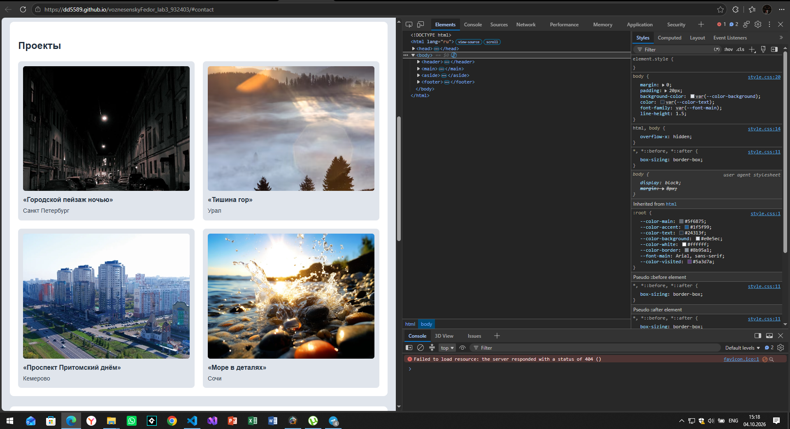
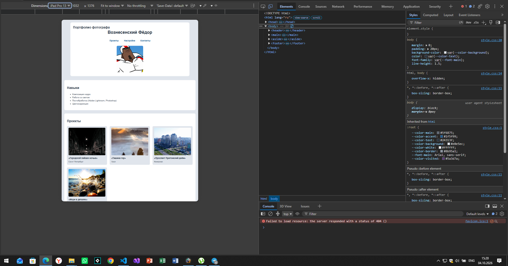
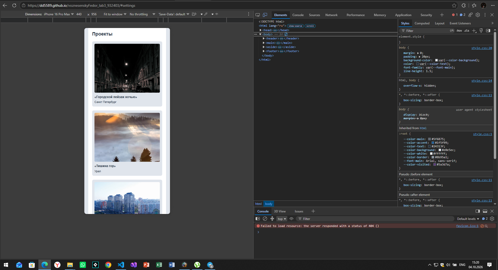

# Лабораторная №3. Вёрстка макета с помощью Flexbox и Grid

**Вариант 11**  
**Тема:** Фотограф и визуальный сторителлер

## Цель работы

Освоить Flexbox для одномерных макетов и CSS Grid для двумерных, а также принципы адаптивной вёрстки.

## Описание

Одностраничный сайт-портфолио фотографа. Страница содержит информацию об авторе, его навыках, фотопроектах, настройках съёмки и форму обратной связи. Дизайн выполнен в серо-синей цветовой гамме с использованием CSS-переменных.

## Структура страницы

* **Шапка (`<header>`)** — Имя и фамилия автора, заголовок страницы и аватар.
* **Основной контент (`<main>`)**
  * Секция **«Навыки»** — основные навыки фотографа.
  * Секция **«Проекты»** — четыре фотопроекта.
  * Секция **«Настройки»** — основные параметры съёмки.
  * **Форма обратной связи** — поля имени, Email, сообщения и кнопка отправки.
* **Боковая панель (`<aside>`)** — Любимое направление — пейзажная фотография, а также ссылка на портфолио.
* **Подвал (`<footer>`)** — Имя автора и год.

## Проверка на разных экранах

В DevTools браузера проверено 3 версии — десктоп, планшет и телефон. Ниже приведены снимки с проверкой:

### 1. Десктоп-версия

### 2. Планшетная версия

### 3. Мобильная версия

> **Примечание:** На мобильной и планшетной версии был учтён нюанс с тапами (через `@media (hover: hover)`), чтобы изображения не «залипали» при нажатии. На десктоп-версии ховер-эффекты работают стандартно через курсор мыши.

## Особенности CSS

В работе используются:
* CSS-переменные;
* Flexbox;
* CSS Grid;
* Media Queries для адаптивной вёрстки;
* псевдоклассы `:hover`, `:active`, `:focus`, `:visited`;
* эффекты масштабирования и изменения цвета изображений.

## Запуск

Откройте файл `index.html` в любом современном браузере.
